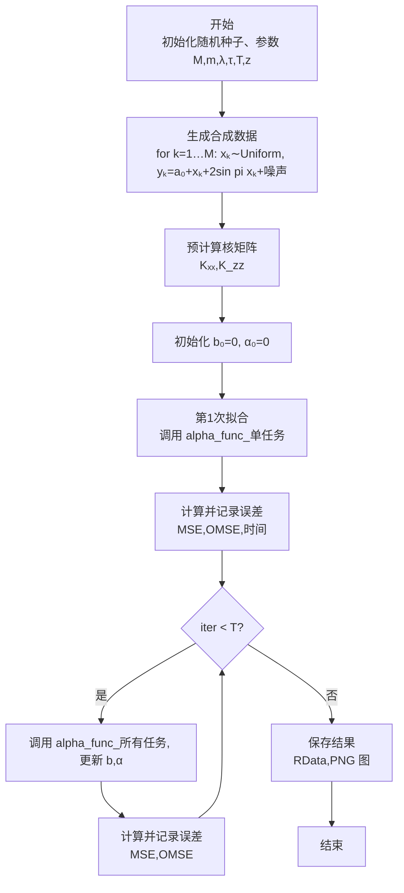

Algorithm flow chart

Algorithm 

Input:
  M (任务数), 
  n=(n₁,…,n_M), total N,
  λ (正则化),
  τ (分位数水平),
  T (最大迭代次数),
  z (m 内点),
  kernel k(x,y)

Output:
  拟合系数 α, 截距 b, 结果表 results

1:  Set seed, 初始化参数
2:  for k = 1…M do
3:      生成 x_k ∼ Uniform(0,1), 
           y_k ← a₀ + x_k + 2 sin(π x_k) + noise
4:  end for

5:  预计算 K_zz ← [k(z_i,z_j)]_{m×m}

6:  b ← 0; α ← 0 (长度 m)

7:  // 初始拟合，单任务
8:  (b, α) ← alpha_func(k, x₁, y₁, z, α, b, λ, method, τ, iter=1)
9:  Compute MSE₁, OMSE₁; append to results

10: for iter = 2…T do
11:     (b, α) ← alpha_func(k, x_list, y_list, z, α, b, λ, method, τ, iter)
12:     Compute MSE_iter, OMSE_iter; append to results
13: end for

14: 保存结果 tables 和 图像
15: return (b, α, results)
